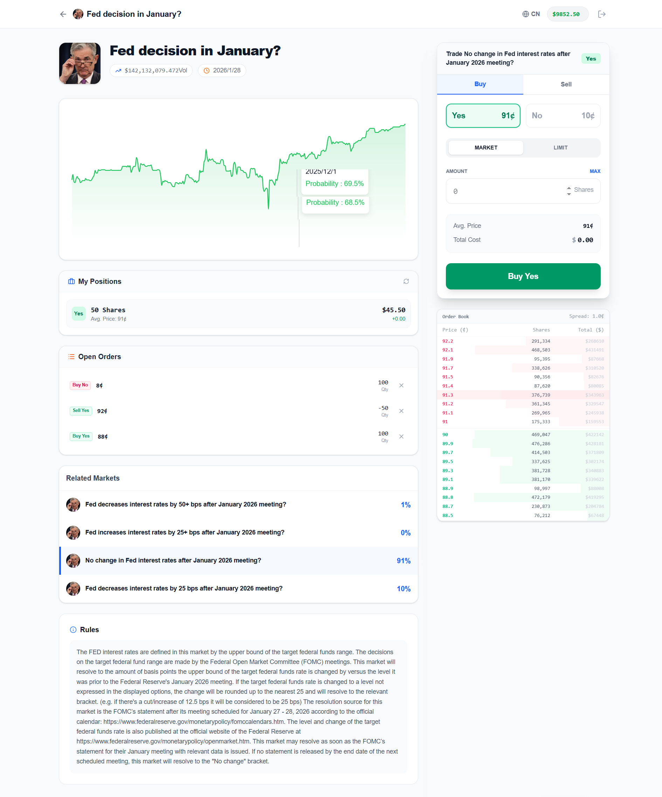
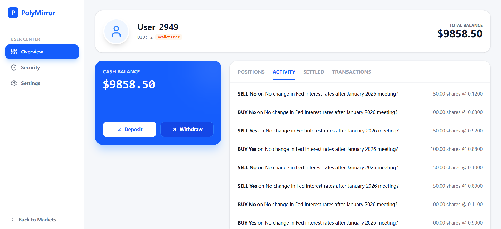
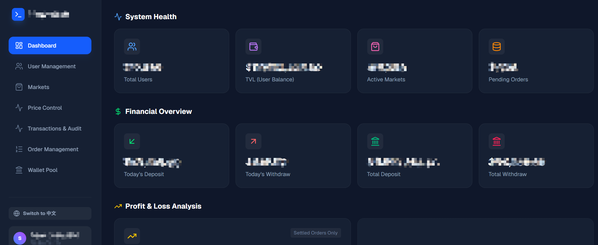

# Polymarket
# PolyMirror - Enterprise Grade Prediction Market Solution (Polymarket Clone)

[Put a High-Quality Banner Image or GIF of the Dashboard Here]

## 🚀 Introduction (项目介绍)

**PolyMirror** is a fully-featured, production-ready prediction market platform similar to Polymarket. It allows users to trade on real-world event outcomes (Crypto, Politics, Sports, etc.) with real-time order books and automated settlement.

This solution includes a **High-Performance Matching Engine**, **Automated Data Spiders** (syncing events from global sources), and a powerful **Admin Dashboard** for full financial control.

> 🇨🇳 中文：这是一个企业级的预测市场交易系统（仿 Polymarket）。包含完整的用户端、管理后台、撮合引擎和自动化数据爬虫。开箱即用，适合想要快速搭建 Web3 预测市场平台的团队。

---

## ✨ Key Features (核心功能)

### 🖥️ User Frontend (用户端)
* **Mobile-First Design**: Responsive UI built with Next.js & TailwindCSS.
* **Real-time Trading**: Buy/Sell "Yes" or "No" shares with instant price updates.
* **Portfolio Management**: Visual PnL analysis and position tracking.
* **Secure Wallet**: Integrated deposit/withdrawal system (EVM compatible).
* **Multi-language Support**: Native English & Chinese support (i18n).

### 🛡️ Admin Dashboard (管理后台)
* **Financial Audit**: Track every deposit, withdrawal, and balance change.
* **Risk Control**: Manually adjust prices (Ghost Price) and offset logic.
* **Market Management**: 
    * **One-Click Import**: Auto-fetch markets from Polymarket via built-in spiders.
    * **Manual Settlement**: Force settle markets in case of oracle failure.
* **User CRM**: Manage KYC status, ban users, or adjust balances.
* **Visual Data**: Dashboard with TVL, active users, and net profit charts.

### ⚙️ Backend Core (后端核心)
* **Tech Stack**: Node.js, Express, PostgreSQL, Redis.
* **Dual-Spider System**: 
    * ⚡ Fast Spider (10s): Syncs real-time prices and order books.
    * 🐢 Slow Spider (5min): Syncs event titles, images, and metadata.
* **Matching Engine**: Centralized limit order book (CLOB) logic.
* **Scalable Architecture**: Support for high concurrency via PM2 clustering.

---

## 📸 Screenshots (界面展示)

### User Interface
| Home Page | Trading Interface | Portfolio |
| :---: | :---: | :---: |
|  |  |  |

### Admin Panel
| Dashboard Overview | User Management | Market Management | Price Control | Financial Audit | Order Management | Wallet Management |
| :---: | :---: | :---: |
|  |  |  |

---

## 🛠️ Technology Stack (技术栈)

* **Frontend**: Next.js 14, React 19, TailwindCSS, Lucide Icons, Axios.
* **Backend**: Node.js, Express.js.
* **Database**: PostgreSQL (Data persistence), Redis (Caching & Real-time queue).
* **DevOps**: PM2, Nginx, Docker ready.

---

### Contact Me (联系方式)
If you are interested in purchasing this system or need customization:

* **Telegram**: [@kiki_christina](https://t.me/kiki_christina)

> Note: This repository is for demonstration purposes only. The source code is not open source.
